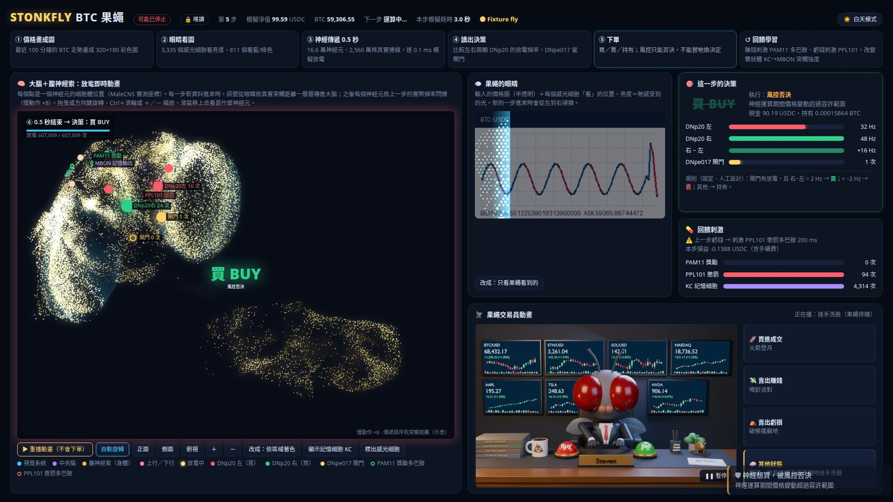
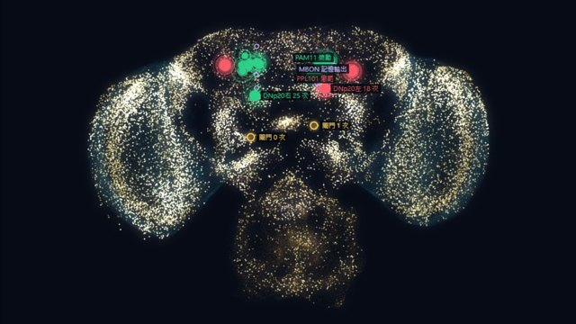
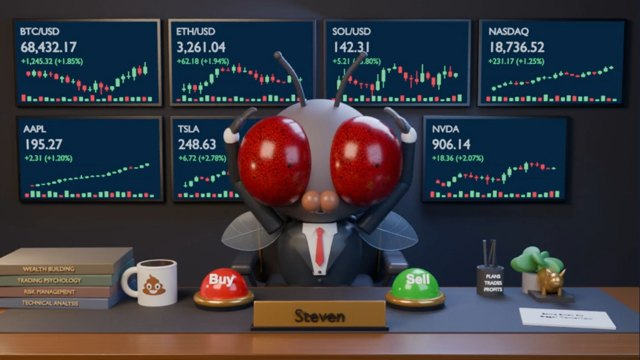
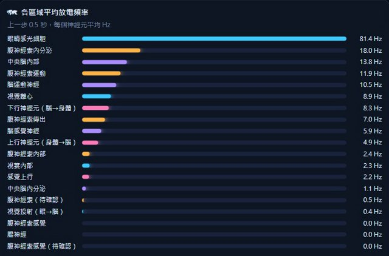
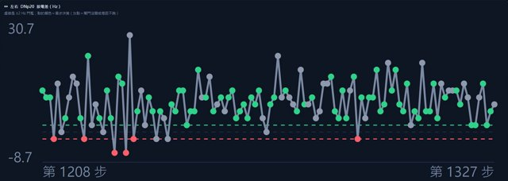

# Stonkfly Dashboard — watch a fruit-fly brain trade crypto



A live, read-only web dashboard for **[Stonkfly](https://github.com/nftechie/stonkfly)** — an open-source experiment that
feeds a crypto price chart into a simulation of the complete male fruit-fly nervous system
(**MaleCNS v1.0, 166,700 neurons, 25.6 million connections**) and lets the fly's neural output propose buy / sell / hold.

This repository is the upstream Stonkfly code (full git history, MIT) **plus a dashboard** that shows, step by step,
what the fly saw, how the spikes travelled through its brain, what it decided and what reward or punishment it received.

> **Paper trading by default. Not financial advice.** Stonkfly's own README states:
> *"Profitable learning has not been demonstrated."* See [Disclaimer](#disclaimer).

[繁體中文說明](#繁體中文說明) · [Quick start](#quick-start) · [Dashboard configuration](#dashboard-configuration) · [Credits](#credits)

---

## What the dashboard shows

| Panel | What you see |
|---|---|
| **Pipeline strip** | Price chart → eyes → 0.5 s neural propagation → readout → order → reinforcement, lighting up as each step happens |
| **Brain + ventral nerve cord** | Every neuron at its measured MaleCNS soma position; each new step replays the spikes spreading outward from the photoreceptors (rotate / zoom / hover for neuron types) |
| **The fly's eyes** | The 320×180 price image the fly was shown, overlaid with the 3,335 brightness (R1–R6) and 811 colour (R8) photoreceptor samples |
| **Decision card** | Left vs right **DNp20** firing rate, their difference, the **DNpe017** gate, and whether the risk guard filled or vetoed the order |
| **Reinforcement** | Profit stimulates 15 **PAM11** reward dopamine cells, loss stimulates 2 **PPL101** aversive cells; KC memory-cell activity |
| **Fly trader animation** | A 3D fly at a trading desk: rocket (buy fill), cash party (profitable sell), broken tent (losing sell), grooming (hold / veto / stopped) |
| **Charts** | Price vs simulated equity with trade markers, DNp20 difference over time, dopamine pulses, KC→MBON synaptic efficacy, firing rate per brain region |
| **Multiple flies** | Optional links between several dashboards (e.g. a BTC fly and a second fly on another port) |
| **Day / night theme** | Toggle, remembered per browser; `?theme=light` for screenshots |

The UI text is Traditional Chinese (zh-Hant). The server is read-only: it only reads the run directory and answers `405` to every non-GET request.

<p>


</p>
<p>


</p>

## How it works

```
Coinbase public prices ──► 320×180 RGB chart ──► 3,335 R1–R6 + 811 R8 photoreceptor inputs
                                                        │
                                  MaleCNS v1.0 spiking simulation (0.1 ms steps, 0.5 s per decision)
                                                        │
                    DNp20 right − left > 2 Hz and DNpe017 gate fired → BUY   (< −2 Hz → SELL, else HOLD)
                                                        │
                           Risk guard (limits, cooldown, loss stop) → paper fill or veto
                                                        │
          next step: portfolio P&L → PAM11 reward / PPL101 aversive dopamine pulse → KC→MBON plasticity
```

The decoding rule and the reinforcement signals are **engineered**, not discovered biology. Details and caveats:
[docs/model.md](docs/model.md), [docs/operations.md](docs/operations.md), [docs/validation.md](docs/validation.md).

## Repository layout

```
stonkfly/              upstream simulation, market, broker, risk guard (unchanged from nftechie/stonkfly)
tests/                 upstream tests
dashboard/
  server.py            read-only HTTP server (stdlib + numpy/pyarrow)
  index.html           the whole front end (vanilla JS + canvas, no build step, no CDN)
  anim/*.mp4           3D fly-trader clips (buy / sell_profit / sell_loss / hold)
ops/
  flyguard.sh          optional watchdog for a long-running paper fly
  stonkfly@.service    optional systemd user unit for the fly
  stonkfly-dashboard@.service   optional systemd user unit for the dashboard
docs/                  model / operations / validation notes, upstream README, screenshots
```

## Requirements

- **Linux or macOS** (the runner uses `fcntl`; on Windows use **WSL2**)
- **Python 3.11+** and a **C++17 compiler** (`g++`/`clang++`) for the neural kernel
- **~16 GB RAM** recommended (upstream guidance); the dashboard itself uses well under 100 MB after its first start
- **~5 GB disk**: `prepare` downloads about 1.1 GB of MaleCNS data and builds derived files
- A modern browser (Chrome / Edge / Firefox / Safari)

## Quick start

```sh
git clone https://github.com/Bgihe/stonkfly-dashboard.git
cd stonkfly-dashboard
python3.11 -m venv .venv
source .venv/bin/activate
pip install -e '.[test]'

# 1. Download and verify the connectome data (≈1.1 GB, once)
python -m stonkfly prepare

# 2a. Real public BTC-USDC prices, simulated $100 paper account, one decision per minute
python -m stonkfly run                     # writes runs/paper/, Ctrl-C to stop, same command resumes

# 2b. …or a fast offline demo with a synthetic market (no network needed)
python -m stonkfly run --fixture --fast --steps 10 --out runs/fixture
```

In a second terminal (same venv, from the repository root):

```sh
python dashboard/server.py runs/paper      # or runs/fixture
# → open http://127.0.0.1:8765
```

The first dashboard start builds `dashboard/cache/` (neuron positions and hop distances, about a minute);
later starts are instant. The page refreshes every 4 seconds and animates each new step.

## Dashboard configuration

All settings are environment variables; the only positional argument is the run directory.

| Variable | Default | Meaning |
|---|---|---|
| `PORT` | `8765` | HTTP port |
| `HOST` | `127.0.0.1` | Bind address. Use `0.0.0.0` to view it from other devices on your LAN (read-only, **no authentication** — don't expose it to the internet) |
| `STONKFLY_RUN` | `runs/paper` | Run directory, if not given as argument |
| `STONKFLY_ROOT` | repository root | Where the `stonkfly` package lives |
| `STONKFLY_DATA` | `<root>/data` | Prepared MaleCNS data (same variable the simulator uses) |
| `STONKFLY_VIZ_CACHE` | `dashboard/cache` | Derived neuron-position cache |
| `STONKFLY_ANIM` | `dashboard/anim` | Folder with `buy.mp4`, `sell_profit.mp4`, `sell_loss.mp4`, `hold.mp4` |
| `STONKFLY_FLIES` | *(empty)* | Links between dashboards on the same host, e.g. `BTC fly:8765,ETH fly:8766` |

Two flies side by side:

```sh
python -m stonkfly run --products BTC-USDC --out runs/btc &
python -m stonkfly run --products ETH-USDC --out runs/eth &
STONKFLY_FLIES="BTC fly:8765,ETH fly:8766" PORT=8765 python dashboard/server.py runs/btc &
STONKFLY_FLIES="BTC fly:8765,ETH fly:8766" PORT=8766 python dashboard/server.py runs/eth &
```

### Running it 24/7 (optional)

`ops/` contains a watchdog and systemd user units. `flyguard.sh` restarts a paper fly after transient
errors (network drops) but **stays down** on a STOP file, a financial loss stop, or unsettled orders.
It never passes `--live`. Telegram notices are optional (`TG_TOKEN` / `TG_CHAT` in an env file outside git).
See the comments at the top of each file.

## Paper vs live trading

- **Paper is the default.** Real public prices, simulated fills with a 0.6 % fee per side, no API key.
- **Live trading is off unless you do all of this yourself:** a dedicated Coinbase Advanced portfolio with at most 100 USDC,
  a portfolio-scoped ECDSA key with View + Trade and **no Transfer**, `.env` with `STONKFLY_LIVE=I_ACCEPT_REAL_TRADES`,
  and the `--live` flag. Start with `--live --preflight-only`.
- Built-in limits (upstream): $100 max funding, $10 max order incl. fees, 24 attempts/day, ≥ 60 s between orders,
  no shorts / leverage / transfers, $20 drawdown stops new orders (**it does not liquidate or cap further losses**).
- Never commit `.env`, `coinbase-key.json` or `runs/` — they are in `.gitignore`.

Full procedure: [docs/operations.md](docs/operations.md).

## Disclaimer

This is a science / art experiment, **not a trading strategy and not investment advice**. There is no evidence that the
fly learns to trade profitably; the upstream authors explicitly say profitable learning has not been demonstrated.
The "decision" is a fixed, hand-designed readout of simulated neurons; dopamine pulses are engineered inputs, not modeled pain or pleasure.
Crypto markets are volatile. If you enable live trading you do so entirely at your own risk and may lose all funds you allocate.
The software is provided "as is", without warranty of any kind.

## Credits

- **[Stonkfly](https://github.com/nftechie/stonkfly)** by Alex Wormuth ([@nftechie](https://github.com/nftechie)) — the simulation,
  trading environment, execution guard and AgentKit bridge (MIT). Its neural core is adapted from **[DOOMFLY](https://github.com/nftechie/doomfly)**.
- **[MaleCNS v1.0](https://male-cns.janelia.org/)** connectome — the MaleCNS collaboration (Janelia Research Campus, Google Research and
  collaborators), **CC BY 4.0**. Downloaded separately by `prepare`; cite the dataset and its paper when publishing results.
- [Coinbase AgentKit](https://github.com/coinbase/agentkit) and [Coinbase Advanced Python SDK](https://github.com/coinbase/coinbase-advanced-py) (Apache-2.0).
  Not an official Coinbase product.
- Dashboard, fly-trader animations and ops scripts: added in this repository.

See [THIRD_PARTY.md](THIRD_PARTY.md).

## License

[MIT](LICENSE). The upstream copyright notice is preserved; the dashboard and ops additions are released under the same MIT terms.
The MaleCNS data is **not** included and remains under CC BY 4.0.

---

## 繁體中文說明

**讓果蠅大腦炒幣的即時儀表板。** 本專案以開源專案 [Stonkfly](https://github.com/nftechie/stonkfly)（作者 Alex Wormuth，MIT）為基礎，
保留原作者完整 git 歷史與授權，另外加上一個**唯讀網頁儀表板**：即時顯示果蠅眼睛看到的價格圖、訊號在 16.6 萬顆神經元裡傳遞的動畫、
左右 DNp20 放電差與 DNpe017 閘門、下單結果、多巴胺獎懲，以及 3D 果蠅交易員動畫。

### 功能
- 大腦＋腹神經索 3D 點雲，每一步重播放電從眼睛擴散的過程（可旋轉、縮放、滑鼠查神經元）
- 果蠅眼睛：輸入的價格圖＋ 3,335 個亮度感光細胞與 811 個色覺感光細胞的取樣位置
- 決策卡：DNp20 左／右放電頻率、差值、DNpe017 閘門、風控成交或否決
- 回饋刺激：賺錢刺激 PAM11 獎勵多巴胺、虧錢刺激 PPL101 懲罰多巴胺
- 果蠅交易員動畫：買進＝火箭登月、賣出賺錢＝噴鈔派對、賣出虧損＝破帳篷、其他＝搓手洗臉
- 價格與模擬淨值、DNp20 差值、多巴胺、突觸強度、各腦區放電頻率圖表
- 多隻果蠅互相連結、白天／黑夜模式

### 快速開始（Linux / macOS；Windows 請用 WSL2）
```sh
git clone https://github.com/Bgihe/stonkfly-dashboard.git
cd stonkfly-dashboard
python3.11 -m venv .venv && source .venv/bin/activate
pip install -e '.[test]'
python -m stonkfly prepare              # 下載神經連結圖資料（約 1.1 GB，只要一次）
python -m stonkfly run                  # 真實公開 BTC 價格＋ 100 美元模擬帳戶，每分鐘一步
# 另開一個終端機：
python dashboard/server.py runs/paper   # 打開 http://127.0.0.1:8765
```
沒有網路也能先試：`python -m stonkfly run --fixture --fast --steps 10 --out runs/fixture`，再 `python dashboard/server.py runs/fixture`。
第一次啟動儀表板會花約一分鐘建立 `dashboard/cache/`。建議 16 GB 記憶體。設定一律用環境變數（見上方 [Dashboard configuration](#dashboard-configuration)），
想讓區網其他裝置看就設 `HOST=0.0.0.0`（唯讀、沒有登入保護，不要開到公網）。

### 模擬盤與真實交易
- **預設是 paper（模擬）交易**：用真實公開價格，但成交是模擬的，不需要任何金鑰。
- 真實下單必須由你自己完成：專用 Coinbase Advanced 子帳戶（最多 100 USDC）、只有 View＋Trade 且**不能轉帳**的金鑰、
  `.env` 設定 `STONKFLY_LIVE=I_ACCEPT_REAL_TRADES`，再加 `--live` 參數。內建上限：每單最多 10 美元、每天 24 次、
  兩單至少間隔 60 秒、虧損 20 美元停止下新單（**不會自動平倉**）。
- `.env`、`coinbase-key.json`、`runs/` 都已排除在 git 之外，千萬不要上傳。

### 免責聲明
這是科學／藝術實驗，**不是投資建議，也不是交易策略**。原作者明確表示「尚未證明能學會獲利」。
「決策」是人工設計的固定讀出規則，多巴胺刺激也是工程上加的訊號，不代表果蠅真的會痛或會學會賺錢。
若自行開啟真實交易，所有風險與損失由你自行承擔。

### 致謝與授權
程式基於 [nftechie/stonkfly](https://github.com/nftechie/stonkfly)（MIT）；神經連結圖資料為 [MaleCNS v1.0](https://male-cns.janelia.org/)
（Janelia Research Campus、Google Research 等合作團隊，CC BY 4.0，需另外下載、發表時請引用）。本專案新增的儀表板、動畫與維運腳本同樣以 MIT 釋出。
