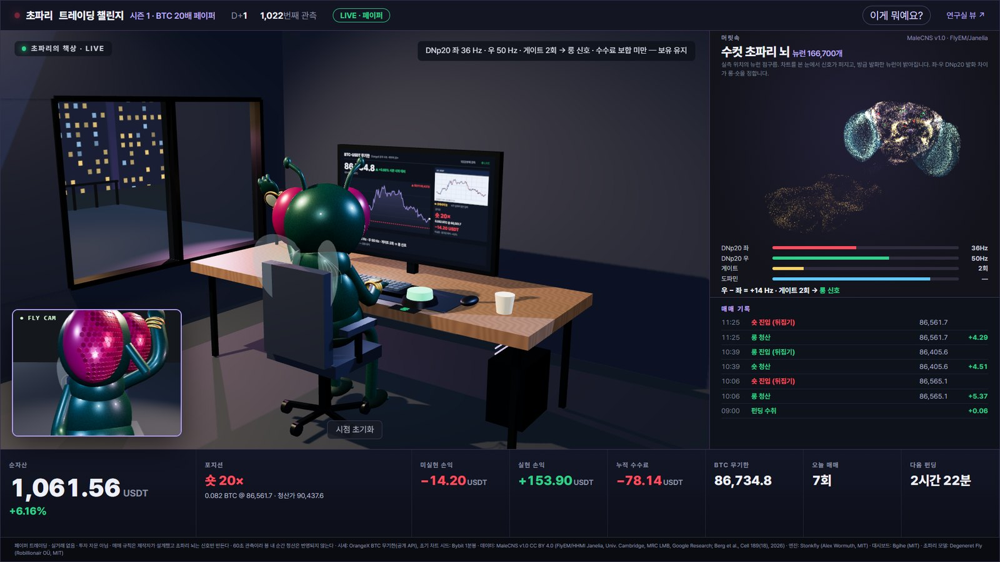

# 초파리 트레이딩 챌린지 🪰📈

**진짜 초파리 뇌 연결 지도(MaleCNS v1.0, 뉴런 166,700개)를 컴퓨터로 돌려 1분마다 비트코인 차트를 보여 주고,
그 반응으로 BTC 무기한 선물을 페이퍼 트레이딩합니다.** 책상 앞 3D 초파리가 매매할 때마다 춤추고, 강제청산에
기절하고, 순자산에 따라 방이 부자가 됐다가 압류당하는 모습을 생중계할 수 있습니다.

> 페이퍼 트레이딩 전용입니다. 실제 주문을 내지 않으며, 어떤 내용도 투자 자문이 아닙니다.
> 매매 규칙은 사람이 설계했고 초파리 뇌는 그 규칙에 들어갈 롱·숏 신호만 만듭니다.



📖 **제작 가이드 PDF(설치·운영·웹 공개·방송·콘텐츠 팁, 16쪽): [docs/guide-ko.pdf](docs/guide-ko.pdf)**

| 화면 | 주소 | 설명 |
|---|---|---|
| 3D 방송 | `http://127.0.0.1:8765/room/` | 책상 앞 초파리, 뇌 점구름, 잔고 HUD, 매매 기록 |
| 연구실 뷰 | `http://127.0.0.1:8765/` | 망막 입력·뉴런 발화·시냅스 변화까지 보는 상세 대시보드 |
| 데모 | `/room/?demo=1` | 2분짜리 가상 시즌(익절 춤·강제청산·파산까지 전부) |
| 방송용 | `/room/?stream=1` | 버튼·커서 없는 화면 — OBS 브라우저 소스용 |

## 빠른 시작

**Windows 10/11** — 저장소를 받아 `install\windows-setup.cmd`를 더블클릭합니다.
WSL2 우분투 설치 확인 → 프로그램 설치 → 바탕화면 바로가기 → (선택) 무인 운영 설정까지 안내합니다.

**Ubuntu / WSL2 안에서 직접**

```bash
git clone https://github.com/RichTradingSchool/fly-trader.git ~/fly-trader/stonkfly-dashboard
cd ~/fly-trader/stonkfly-dashboard
bash install/install.sh        # 10~30분 (뇌 데이터 약 1.1 GB 다운로드 포함)
./fly start s1                 # 시즌 s1 시작
./fly open                     # 3D 방송 화면 열기
```

인터넷 없이 먼저 보고 싶으면 `./fly demo`.

## 명령어

| 명령 | 하는 일 |
|---|---|
| `./fly start s1` | 시즌 시작(러너 + 대시보드). 이미 있으면 이어서 실행 |
| `./fly status` | 순자산·포지션·관측 수·정지 여부 |
| `./fly open` | 브라우저로 3D 방송 화면 |
| `./fly logs s1` | 실시간 로그 |
| `./fly stop s1` / `./fly resume s1` | 정지(기록 보존) / 재개 |
| `./fly public s1` | Cloudflare 터널로 공개 주소 만들기 |
| `./fly site` | 웹 뷰어 정적 파일(`site/`) 빌드 |

## 시즌 설정

처음 `./fly start s1`을 하면 `~/.config/stonkfly/s1.env`가 생깁니다. **첫 관측 전에만** 바꾸세요.
시작 후에 바꾸면 설정 서명이 달라져 이어서 실행이 거부됩니다(새 이름의 시즌으로 시작하면 됩니다).

```ini
# 화면에 보이는 이름 (20자 이내)
FLY_NAME=초파리
# 격리 레버리지 (1~125)
FLY_LEVERAGE=20
# 진입마다 잔고에서 쓰는 증거금 비율
FLY_MARGIN=0.33
```

주석은 반드시 줄 맨 앞에 `#`로 쓰세요(값 뒤에 붙이면 값의 일부가 됩니다).

시작 자금은 1,000 USDT로 고정입니다(부자 방 아이템 기준 금액이 1,000 USDT 시작에 맞춰져 있습니다).

기본 규칙: OrangeX BTC-USDT 무기한 공개 시세 · 1분 관측 · 반대 신호가 와도 수수료를 빼고 본전 이상일 때만
뒤집기 · 손절 없음(회복 또는 강제청산까지 보유) · 최소 주문도 못 내면 파산으로 종료.
순자산 1,200 / 1,500 / 2,000 / 3,000 / 5,000 / 10,000 / 20,000 / 50,000 USDT마다 방에 아이템이 생기고,
다시 떨어지면 압류됩니다.

> ⚠ 시즌 중에는 코드를 업데이트(`git pull`)하지 마세요. 엔진 소스 해시가 바뀌면 재개가 거부됩니다.

## 웹 링크로 공개하기 · 라이브 방송

- **웹 뷰어**: `ops/windows/publish-site.ps1`이 `site/`를 GitHub Pages에 올립니다. 휴대폰 세로 화면도 지원합니다.
- **실시간 데이터**: `./fly public s1`이 Cloudflare 터널로 대시보드를 공개하고, `ops/windows/set-feed.ps1`이
  그 주소를 웹 뷰어의 `feed.json`에 반영합니다. 연결이 없으면 웹 뷰어는 데모 시즌을 보여 줍니다.
- **OBS 생중계**: `ops/obs/fly-trader-obs.json`을 OBS의 장면 모음 → 가져오기로 불러오면 1920×1080 브라우저
  소스가 준비됩니다. 방송 키는 OBS 설정에 직접 넣으세요.

자세한 절차는 [docs/publish-ko.md](docs/publish-ko.md).

## 요구 사항

- Windows 10(2004+)/11 + WSL2, 또는 Ubuntu 22.04/24.04
- CPU 4코어 이상 (i5-10400F 기준 관측 1회 약 8초 — 60초 간격 안에 여유 있게 끝남), GPU 불필요
- RAM 8 GB 이상 (엔진 약 0.9 GB), 여유 디스크 5 GB, 인터넷(공개 시세만 사용 — 거래소 계정·API 키 불필요)
- 7일 무인 운영: 절전 끄기, WSL 킵얼라이브(설치 도우미가 등록), `loginctl enable-linger`

## 동작 원리

1. **눈** — 최근 가격 차트를 320×180 이미지로 그려 광수용체(R1–R8)에 빛 자극으로 넣습니다.
2. **뇌** — MaleCNS 연결 지도 위의 스파이킹 신경망을 0.5초 시뮬레이션합니다(C++ 커널).
3. **결정** — 좌·우 하행 뉴런 DNp20의 평균 발화율 차이(오른쪽 우세 = 롱, 왼쪽 = 숏)와 게이트 뉴런 DNpe017.
4. **보상** — 손익에 따라 보상(PAM11)·처벌(PPL101) 도파민 뉴런을 자극하고 시냅스 효율이 조금씩 바뀝니다.
   이것이 시장을 ‘학습’했다는 증거는 아닙니다.

모델 세부: [docs/model.md](docs/model.md) · 검증: [docs/validation.md](docs/validation.md) ·
운영: [ops/README-perp.md](ops/README-perp.md)

## 크레딧 · 라이선스

- 엔진: [Stonkfly](docs/stonkfly-upstream-README.md) (DOOMFLY 기반, MIT) · 대시보드: [Bgihe/stonkfly-dashboard](https://github.com/Bgihe/stonkfly-dashboard) (MIT, [원본 README](docs/bgihe-dashboard-README.md))
- 3D 초파리: [Degeneret Fly](https://github.com/Rob-bio4/degeneretfly) (Robillionair OÜ, MIT) · three.js (MIT) · Pretendard (SIL OFL 1.1)
- 데이터: [MaleCNS v1.0](https://male-cns.janelia.org/) — FlyEM/HHMI Janelia, Univ. Cambridge, MRC LMB, Google Research (Berg et al., Cell 2026), **CC BY 4.0**. `prepare`가 따로 내려받습니다. 결과를 공개할 때 데이터셋과 논문을 인용하세요.
- 시세: OrangeX 공개 API(BTC-USDT-PERPETUAL), 초기 차트: Bybit 1분봉. 거래소와 제휴한 공식 서비스가 아닙니다.
- 이 저장소의 코드는 MIT 라이선스입니다([LICENSE](LICENSE)). 제3자 목록: [THIRD_PARTY.md](THIRD_PARTY.md).
